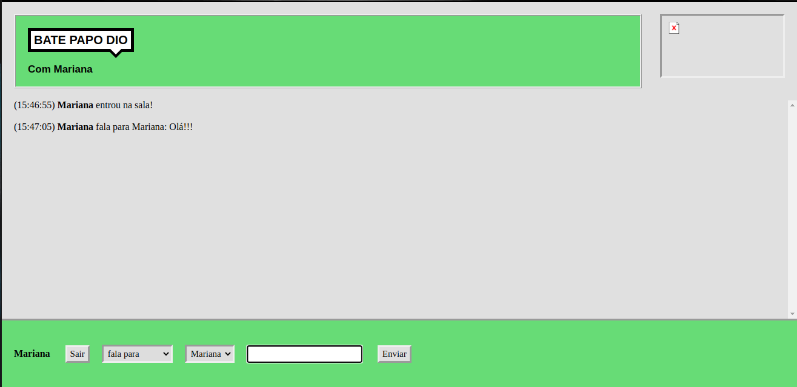

# Bate papo UOL


[](#)
[](https://github.com/mariana-pereira/bate-papo-uol/stargazers)
[](https://github.com/mariana-pereira/bate-papo-uol/network/members)
[](https://github.com/mariana-pereira/bate-papo-uol/graphs/contributors)

> Clone of the old UOL chat, developed for the Digital Inovation One Labs. 
  The Labs can be acessed in this [link](https://web.digitalinnovation.one/labs).

<p align="center">
   
</p>

---

# Techs


- [Node](https://nodejs.org/en/)
- [Socket.io](https://socket.io/)

# Installation

**You need to install [Node.js](https://nodejs.org/en/download/) and [Yarn](https://yarnpkg.com/) first.**

```git clone https://github.com/mariana-pereira/bate-papo-uol```

SSH URLs provide access to a Git repository via SSH, a secure protocol. If you have a SSH key registered in your Github account, clone the project using this command:

```git clone git@github.com:mariana-pereira/bate-papo-uol.git```

Run `yarn` for both client and server to install dependencies.<br />


# Getting Started

Run `yarn start` for both client and server in order to start the application in a development environment.

Open [http://localhost:9000](http://localhost:9000) to view it in the browser.


# Show your support

Give a ⭐️ if this project helped you!

Made with love by [Mariana Pereira](https://github.com/mariana-pereira) :heart:
